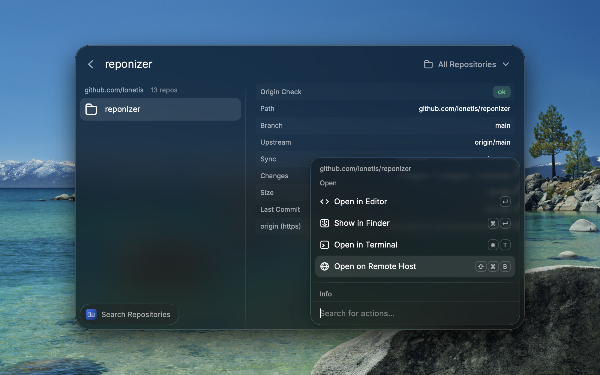
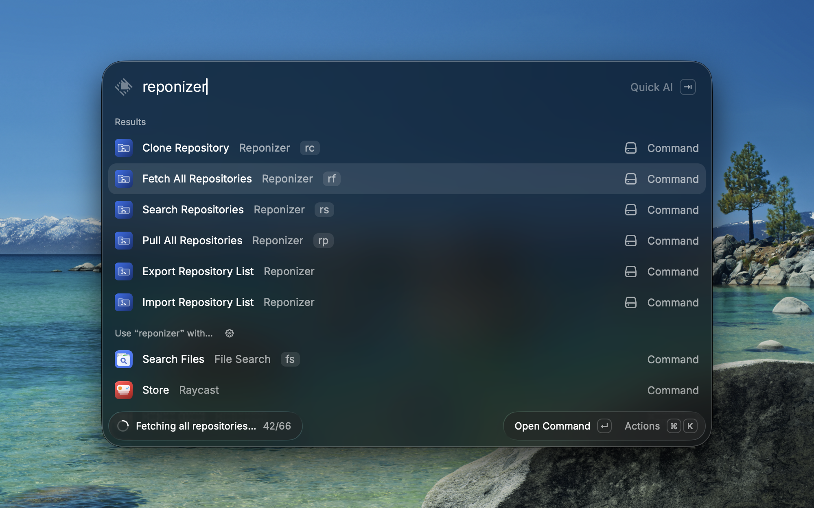
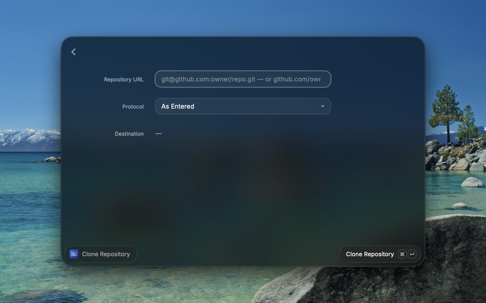

# Reponizer

Reponizer keeps a large, structured git repository folder organized. It works with the `host/owner/repo` layout used by [git-get](https://github.com/grdl/git-get) and [ghq](https://github.com/x-motemen/ghq) — for example `~/repos/github.com/lonetis/reponizer` — and turns Raycast into a fast overview, health check, and toolbox for every repository you have cloned locally.

## Features

- **Hierarchical overview** — all repositories grouped by host and owner, instantly searchable
- **Repo status at a glance** — branch, ahead/behind counts, uncommitted changes, merge conflicts, stashes, and size on disk
- **Remote auditing** — flags repos whose `origin` does not match their location (and repos without any remote), with one-key auto-fix, folder relocation, and duplicate detection
- **Remote management** — add, edit, rename, and delete remotes; switch any remote between SSH and HTTPS
- **Host aliases** — keep short folder names like `buw` for long hosts like `git.uni-wuppertal.de`; auditing, cloning, and relocation all understand the mapping
- **Host-only comparison** — for hosts with opaque repo paths (e.g. Overleaf project IDs), only the host is audited so you can name the folders yourself
- **Fork awareness** — repos with an upstream remote are tagged as forks and show how far they have fallen behind it; filter for all forks or only those behind, and fast-forward one or all of them with *Sync from Upstream*
- **Fork to…** — fork a cloned repo to another host or namespace (`⌘⇧F`), with autocompletion for the hosts and namespaces you already use (GitLab subgroups included) and an optional new name; your fork becomes the origin, the old one is kept as upstream, and the folder moves to its new place. On GitHub you can opt in to a real GitHub fork through the GitHub CLI
- **Create repositories** — set up a new repository as an empty local copy in the right folder, with `origin` already pointing at it (`⌘N` in the list, or the *Create Repository* command); hosts you list under *Push-to-Create Hosts* create them on the first push, anywhere else you create the empty repository on its website and push with *Publish Branch*, and on GitHub you can opt in to the GitHub CLI instead
- **Clone into structure** — paste any git URL (or a bare `github.com/owner/repo` path) and it lands in the right folder, keeping the protocol you pasted; you can also clone straight into a fork of your own
- **Fetch / Pull everything** — bulk fetch and safe fast-forward pulls with progress and a failure report
- **Publish Branch** — push a branch that has never been pushed to `origin` and track it from then on
- **Offload local copies** — verify a repo is fully pushed, then free its disk space while keeping a placeholder; re-download it anytime
- **Export / import** — mirror your repository list across machines via a JSON file or the Raycast-synced snapshot
- **Menu bar health check** *(optional)* — a quiet counter of repositories that need attention
- **Quick actions** — open in your editor, terminal, Finder, or on the remote host's website; copy paths and URLs; move repos to the Trash

## Screenshots

## Setup

Reponizer works out of the box if your repositories live in `~/repos` in a `host/owner/repo` layout. Otherwise, open any Reponizer command, press `⌘ ,`, and set the **Repositories Root**.

### Preferences

- **Repositories Root** — the folder containing all repos (default `~/repos`)
- **Default Protocol** — SSH (default) or HTTPS; used for suggested origin URLs and bare-path clones
- **Max Scan Depth** — how deep to search below the root (increase for GitLab subgroups)
- **Network Concurrency** — how many repos Fetch All / Pull All sync at once (default 4); raise it to finish faster, lower it if your SSH agent (e.g. 1Password) struggles with parallel connections
- **Host Aliases** — comma-separated `alias=host` pairs mapping a folder name to the real remote host, e.g. `buw=git.uni-wuppertal.de, overleaf.com=git.overleaf.com`
- **Host-Only Comparison** — comma-separated hosts (alias or real host) whose repos are audited by host only, so the folder layout below them is up to you
- **Push-to-Create Hosts** — comma-separated hosts (alias or real host) that create a repository when the first push arrives, such as `gitlab.com` or a self-hosted GitLab; new repositories and forks there are pushed right away
- **Upstream Remote** — the remote name that marks a repo as a fork (default `upstream`)
- **Default Namespaces** — comma-separated `host=namespace` pairs preselecting where your forks and new repositories go, e.g. `gitlab.com=me/subgroup, github.com=MyUser`
- **Editor / Terminal** — the apps used by the open actions; besides Terminal.app and iTerm2, terminals like kitty, Alacritty, WezTerm, Ghostty, and Warp open directly in the repository folder

## Commands

| Command | What it does |
| --- | --- |
| **Search Repositories** | The main overview: browse, search, filter, and manage everything |
| **Clone Repository** | Clone a URL into the correct place in the folder structure |
| **Create Repository** | Create a new repository in the folder structure, ready to publish to its host |
| **Fetch All / Pull All Repositories** | Bulk sync; pulls are fast-forward only and skip dirty repos |
| **Export / Import Repository List** | Mirror the repo list across machines |
| **Repository Health** | Menu bar overview (disabled by default; enable it in Raycast settings) |

## Tips

- Press `⌘ I` on any repository to toggle a detail panel with remotes, sync state, and sizes.
- The list opens instantly from cache and rescans in the background; `⌘ R` forces a rescan, `⌥⌘ R` also recomputes folder sizes.
- **Offloading**: Reponizer refuses to offload a repo with unpushed branches, uncommitted changes, untracked files, or stashes — nothing is ever lost. The freed folder keeps a small `reponizer-offloaded.json` placeholder so you (and the import command) know what belongs there.
- **Importing on a fresh machine**: choose *Create Offloaded Placeholders* to mirror the whole structure without downloading anything, then restore repos on demand.
- **Creating repositories**: the new local copy is empty apart from one empty “Initial commit”. Every host works the same by default: on a push-to-create host the push itself creates the repository. Anywhere else — or when that fails — create an **empty** repository (no README or license) on the host's website, which the notification opens for you, then run *Publish Branch* on the new repository. If an empty repository already waits on the host, Reponizer simply pushes to it; if one with commits is there, it stops before creating anything. For a GitHub target the form offers a **GitHub CLI** checkbox: ticked, Reponizer creates the repository with the [GitHub CLI](https://cli.github.com) (`brew install gh`, then `gh auth login`) and pushes right away.
- **Forking**: forks follow the same rules as new repositories. A push-to-create host gets the fork right away, and you pick how much is pushed — all branches and tags, only the current branch, or nothing for now. Anywhere else, or when that fails, create the empty repository on the host's website and run *Push to Origin*, which pushes all branches and tags. An existing empty repository is simply pushed to, and one with commits stops the fork. For a GitHub target, ticking **GitHub CLI** makes a real GitHub fork when the original is someone else's GitHub repository — GitHub copies all branches and tags, and your own local commits go up with *Push to Origin* — and otherwise creates the repository with the GitHub CLI and pushes. GitHub allows one fork of a repository per account, so if you already have one, Reponizer stops and tells you where it is instead of touching anything.

## Troubleshooting

- **SSH authentication fails when fetching or cloning**: Raycast does not inherit your shell environment. Reponizer automatically falls back to the 1Password SSH agent socket if `SSH_AUTH_SOCK` is unset; for other agent setups, configure the agent in `~/.ssh/config` (e.g. via `IdentityAgent`).
- **Repos are missing from the list**: they may be deeper than the configured scan depth, or inside a hidden folder — both are skipped.

## Contributing

Bug reports and pull requests are welcome at [github.com/lonetis/reponizer](https://github.com/lonetis/reponizer).

## License

MIT
